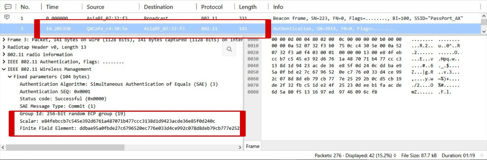
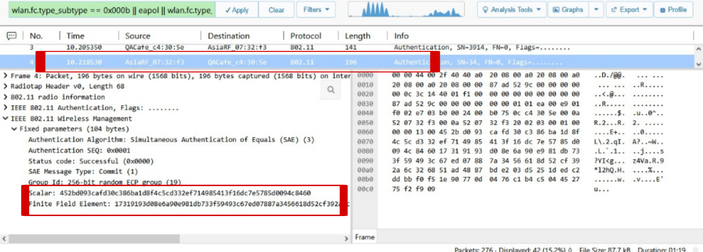

# Phase 1: The SAE Dragonfly Handshake (Commit & Confirm)

WPA3 eliminates the open authentication vulnerabilities of WPA2 by introducing **SAE (Simultaneous Authentication of Equals)**, also known as the Dragonfly Key Exchange.

## 1. SAE Commit (Client $\to$ AP & AP $\to$ Client)
During the Commit phase, both devices take the pre-shared password and map it onto an elliptic curve to generate a mathematical point.

**Client To Acess Point**

**Acess Point To Client**

* **Payload Contents:** Exchanges the **Scalar** and **Finite Field Element**.
* **Cryptographic Property:** The password itself is *never* transmitted over the air. Instead, these numerical values allow both sides to independently compute the exact same secret.

## 2. SAE Confirm (Mutual Validation)
Once both devices compute their respective scalar/field elements, they exchange confirmation tokens to verify alignment:
> *"I computed the key using the password. Did you get the exact same result?"*

**Client To Acess Point**

**Acess Point To Client**

Once both endpoints validate each other's confirmation tokens, authentication succeeds and the protocol transitions to the EAPOL phase.
