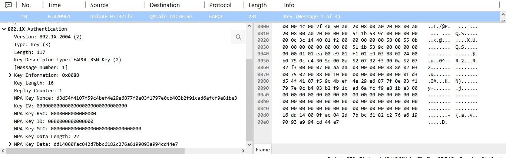
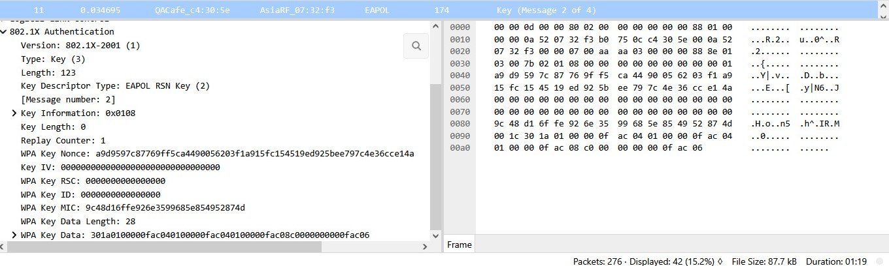
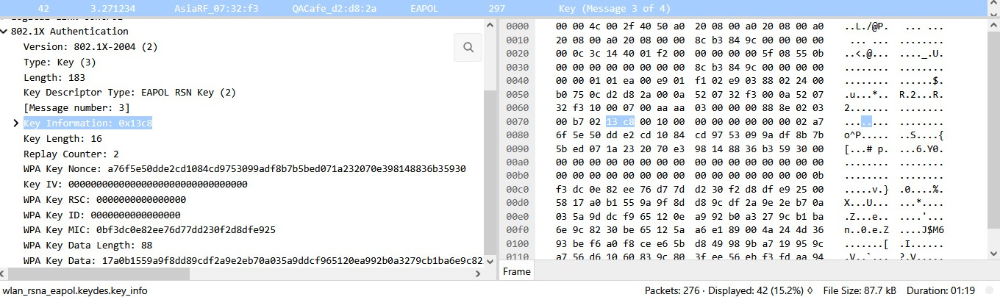

# Phase 2: The EAPOL 4-Way Handshake (WPA3 Variant)

Even though WPA3 retains a 4-step EAPOL structure reminiscent of WPA2, it relies on a **dynamically generated PMK** established during the prior SAE step.

## Message Flow Breakdown

* **Message 1 (AP $\to$ Client):** Transmits the Authenticator Nonce (`ANonce`).

  

* **Message 2 (Client $\to$ AP):** Returns the Supplicant Nonce (`SNonce`) alongside a Message Integrity Code (`MIC`).

* **Message 3 (AP $\to$ Client):** Delivers the encrypted Group Temporal Key (GTK) and confirms the MIC.

* **Message 4 (Client $\to$ AP):** Final acknowledgment (`ACK`) confirming installation of keys.

## Why Offline Dictionary Attacks Fail
In WPA2, an attacker capturing the 4-way handshake could perform offline brute-force attacks against the static PSK hash. Under WPA3, because the PMK is dynamically derived via ECDH during the SAE exchange, capturing these EAPOL frames yields no reusable attack surface.
